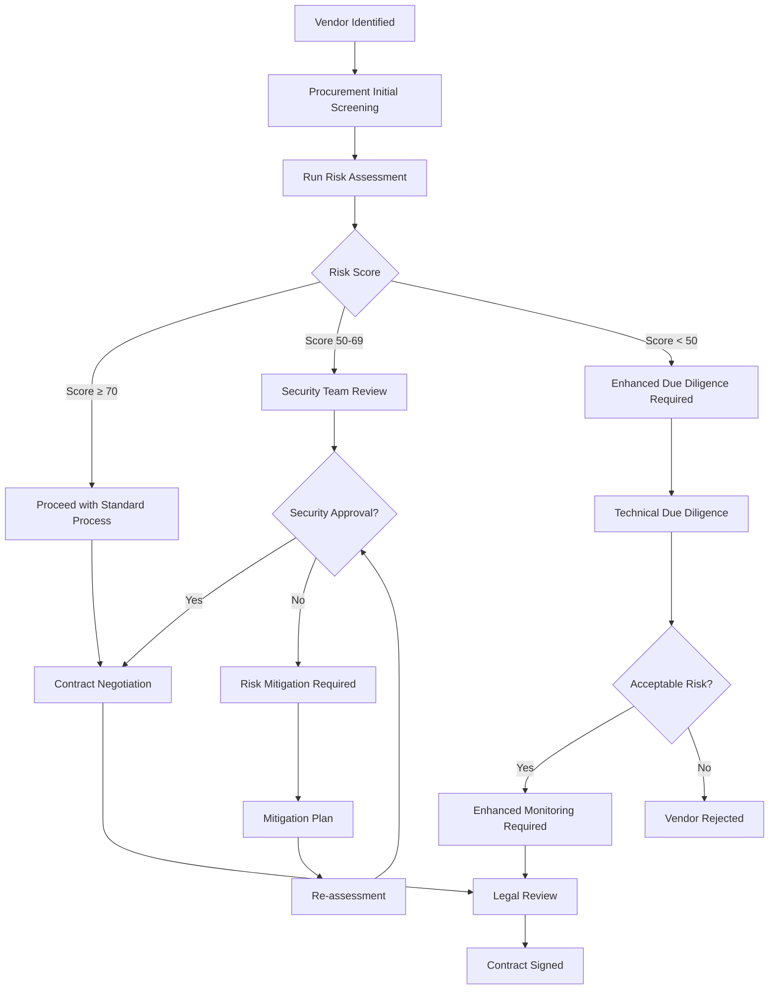
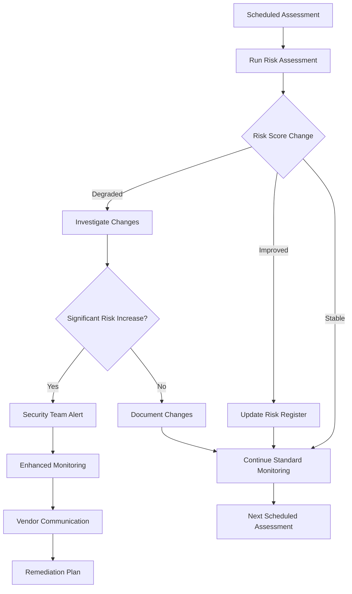
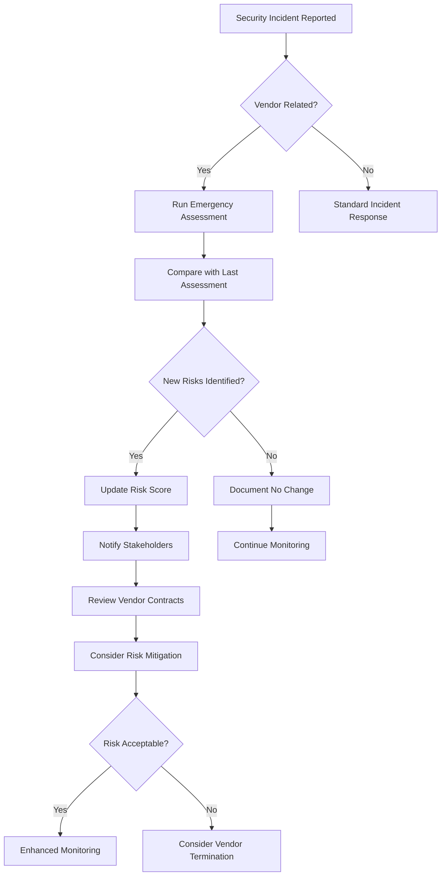

# Vendor Risk Assessment - Process Workflow Guide

## 🏢 Organizational Workflow

This document outlines how different teams and roles should use the Vendor Risk Assessment Tool as part of the broader vendor management process.

## 👥 Roles and Responsibilities

### 1. Procurement Team
**Primary Responsibility**: Initial vendor screening and contract negotiation

**When to Use Tool**:
- Before vendor selection process
- During RFP evaluation
- Before contract signing

**Assessment Type**: Business Risk Assessment (Standard)

**Actions Required**:
- Run assessment for top 3-5 vendor candidates
- Include risk scores in vendor comparison matrix
- Flag any vendors with scores below 60 for security review
- Document assessment results in procurement files

### 2. Security Team
**Primary Responsibility**: Security risk evaluation and ongoing monitoring

**When to Use Tool**:
- Security review of new vendors
- Quarterly reviews of critical vendors
- Incident response for vendor-related security events
- Annual security assessments

**Assessment Type**: 
- Technical Due Diligence (for technical vendors)
- Business Risk Assessment (for business vendors)

**Actions Required**:
- Validate assessment results with vendor documentation
- Perform deep-dive security reviews for high-risk vendors
- Create remediation plans for security gaps
- Maintain vendor risk register

### 3. Legal and Compliance Team
**Primary Responsibility**: Regulatory compliance and contractual risk

**When to Use Tool**:
- Contract review and negotiation
- Compliance audit preparation
- Regulatory reporting requirements
- Due diligence for M&A activities

**Assessment Type**: Business Risk Assessment

**Focus Areas**:
- Compliance framework adherence (SOC 2, ISO 27001, GDPR)
- Data breach history and response
- Regulatory violations or penalties
- Contractual risk factors

### 4. IT Operations Team
**Primary Responsibility**: Technical integration and operational risk

**When to Use Tool**:
- Before system integrations
- API partnership evaluations
- Cloud service provider assessments
- Infrastructure vendor reviews

**Assessment Type**: Technical Due Diligence

**Focus Areas**:
- Network and application security
- Infrastructure reliability
- API security and documentation
- Technical support capabilities

### 5. Vendor Management Team
**Primary Responsibility**: Ongoing vendor relationship management

**When to Use Tool**:
- Regular vendor health checks
- Contract renewal evaluations
- Vendor performance reviews
- Risk monitoring and reporting

**Assessment Type**: Business Risk Assessment (typically)

**Frequency**:
- Critical vendors: Quarterly
- High-value vendors: Semi-annually
- Standard vendors: Annually

## 🔄 Process Workflows

### New Vendor Onboarding Workflow

### Ongoing Vendor Monitoring Workflow

### Incident Response Workflow

## 📋 Standard Operating Procedures

### SOP 1: New Vendor Risk Assessment

**Trigger**: New vendor proposal received

**Owner**: Procurement Team

**Steps**:
1. Collect vendor basic information (domain, services, data handling)
2. Access Vendor Risk Assessment Tool
3. Enter vendor domain and requester email
4. Select "Business Risk Assessment" mode
5. Start assessment and wait for completion (typically 2-5 minutes)
6. Review results and document risk score
7. If score < 60, escalate to Security Team
8. If score ≥ 60, proceed with standard procurement process
9. Include assessment report in vendor file

**Documentation Required**:
- Screenshot of assessment results
- Risk score entry in vendor evaluation matrix
- Escalation notification (if applicable)

### SOP 2: Security Review Process

**Trigger**: Vendor flagged for security review (score < 60) or high-risk vendor type

**Owner**: Security Team

**Steps**:
1. Run Technical Due Diligence assessment
2. Review detailed security findings
3. Cross-reference with vendor-provided security documentation
4. Identify specific security gaps or concerns
5. Develop risk mitigation recommendations
6. Communicate findings to Procurement and Legal teams
7. If risks are unacceptable, recommend vendor rejection
8. If risks are manageable, provide mitigation requirements

**Documentation Required**:
- Technical assessment report
- Security gap analysis
- Risk mitigation recommendations
- Go/no-go recommendation with justification

### SOP 3: Quarterly Vendor Review

**Trigger**: Scheduled quarterly review for critical vendors

**Owner**: Vendor Management Team

**Steps**:
1. Generate list of vendors due for review
2. Run risk assessments for each vendor
3. Compare results with previous assessments
4. Flag any vendors with significant risk score changes
5. Update vendor risk register
6. Schedule reviews with vendors showing increased risk
7. Generate summary report for management

**Documentation Required**:
- Quarterly assessment results
- Risk score trend analysis
- Vendor risk register updates
- Management summary report

## 📊 Risk Scoring Guidelines

### Risk Score Interpretation

| Score Range | Risk Level | Required Actions | Review Frequency |
|-------------|------------|------------------|------------------|
| 80-100 | Very Low | Standard monitoring | Annual |
| 60-79 | Low | Standard monitoring | Semi-annual |
| 40-59 | Medium | Enhanced monitoring | Quarterly |
| 20-39 | High | Risk mitigation required | Monthly |
| 0-19 | Critical | Immediate action required | Weekly |

### Risk Score Factors

**Security Posture (30%)**
- SSL/TLS configuration
- Security headers
- Vulnerability disclosures
- DNS security

**Compliance Status (25%)**
- SOC 2 compliance
- ISO 27001 certification
- GDPR compliance
- Industry-specific regulations

**Data Breach History (25%)**
- Number of incidents
- Severity of breaches
- Response effectiveness
- Recent incidents (weighted higher)

**Operational Factors (20%)**
- Company stability
- Technical infrastructure
- Support capabilities
- AI/automation maturity

## 🚨 Escalation Matrix

### Risk-Based Escalation

| Risk Level | Immediate Notification | Review Required | Approval Needed |
|------------|----------------------|----------------|-----------------|
| Critical (0-19) | CISO, CRO | Security Committee | Executive Team |
| High (20-39) | Security Manager | Security Team | Vendor Management |
| Medium (40-59) | Vendor Manager | Monthly Review | Department Head |
| Low (60-79) | File Documentation | Quarterly Review | Team Lead |
| Very Low (80-100) | None | Annual Review | None |

### Incident-Based Escalation

**Data Breach at Vendor**:
1. Immediate: Run emergency assessment
2. 1 Hour: Notify CISO and Legal
3. 4 Hours: Assess impact on company data
4. 24 Hours: Executive briefing
5. 1 Week: Risk mitigation plan

**Compliance Violation**:
1. Immediate: Notify Compliance Officer
2. 2 Hours: Legal team review
3. 8 Hours: Assess contractual implications
4. 1 Week: Vendor discussion and remediation plan

## 📈 Metrics and KPIs

### Process Metrics
- **Assessment Completion Rate**: Target 100% for new vendors
- **Time to Assessment**: Target < 1 day from vendor identification
- **Risk Score Accuracy**: Validate against known incidents
- **Process Compliance**: % of vendors following proper workflow

### Risk Metrics
- **Average Vendor Risk Score**: Track trends over time
- **High-Risk Vendor Count**: Monitor and reduce over time
- **Risk Mitigation Success Rate**: % of vendors improving scores
- **Incident Prevention**: Correlation between scores and actual incidents

### Business Metrics
- **Vendor Onboarding Time**: Impact of assessment process
- **Contract Negotiation**: Use of risk scores in negotiations
- **Insurance Claims**: Reduction due to better vendor selection
- **Compliance Audit Results**: Pass rate for vendor-related audits

## 🔄 Continuous Improvement

### Monthly Reviews
- Process efficiency analysis
- Tool accuracy validation
- Stakeholder feedback collection
- Metric trend analysis

### Quarterly Updates
- Process refinement based on lessons learned
- Tool enhancement requests
- Training needs assessment
- Benchmark comparison with industry standards

### Annual Assessment
- Complete process review and optimization
- ROI analysis of vendor risk program
- Strategic alignment with business objectives
- Technology stack evaluation

---

*Last Updated: August 2025*
*Version: 1.0*

This process workflow should be reviewed and updated quarterly to ensure alignment with business needs and regulatory requirements.
